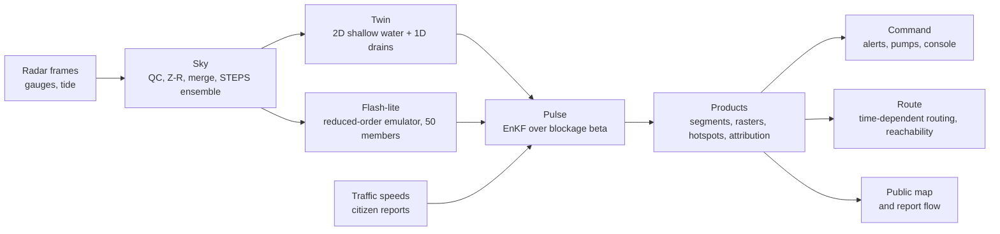

# VARUNA

Street-level urban flood nowcasting digital twin. SIH 2026, problem statement SIH26085
(Ministry of Earth Sciences). Team VIT.

> "Every street. Three hours early."

VARUNA is a self-correcting digital twin of a city's water: sky, surface and sewer. It turns
Doppler-radar rainfall into street-by-street depth forecasts for the next three hours, learns the
city's hidden drains from every flood it sees, and tells emergency services which street will be
impassable, when, and how to get around it.

Everything in the prototype runs live: real Mumbai terrain and roads from open data, a
reconstructed replay of 2 July 2019, simplified-but-real physics for the surface and the drains, a
learning drain map, sub-second what-if, and routes for an ambulance. Every simplification is
labelled on screen and listed in [`docs/SIMPLIFICATIONS.md`](docs/SIMPLIFICATIONS.md).

The build spec is [`CLAUDE.md`](CLAUDE.md); the science reference is
`docs/VARUNA_SIH2026_Blueprint.pdf`. Progress is tracked in the status board in
[`CLAUDE.md` section 1](CLAUDE.md#1-status-board-claude-code-updates-this).

## Quick start

```sh
make setup                        # pnpm + uv workspaces, pre-commit, Playwright Chromium, .env
make city CITY=mumbai             # city-in-a-box layers (downloads on first run, then cached)
make bundle BUNDLE=MUM-2019-07-02 # replay bundle: storm designer, synthetic streams, ground truth
make bake BUNDLE=MUM-2019-07-02   # pre-compute every 5-minute cycle into data/runs/
make demo                         # API :8000 + console :3000 replaying the bundle at 30x
```

Until a bundle is baked, `make demo` prints "No bundle baked yet" and opens the console in its
empty state; nothing crashes. `uv run varuna <target>` is the identical fallback when GNU make
is missing (every target is a one-line wrapper around it).

## Make targets

| Target | Does |
| --- | --- |
| `make help` | Lists every target (the default goal) |
| `make setup` | Installs pnpm and uv workspaces, pre-commit hooks, Playwright Chromium; copies `.env.example` to `.env` |
| `make doctor` | Checks tool versions, `.env`, engines, city layers, bundles and runs |
| `make city CITY=mumbai` | Builds city-in-a-box layers from cache (downloads on first run) into `city/<city>/` |
| `make city-cache CITY=chennai` | Downloads the open data for a city into `city/cache/` only (Chennai pre-cache) |
| `make bundle BUNDLE=MUM-2019-07-02` | Generates a replay bundle (storm designer, synthetic streams, curated ground truth) |
| `make bake BUNDLE=MUM-2019-07-02` | Pre-computes every 5-minute cycle of a bundle into `data/runs/` |
| `make train` | Fits Flash-lite from Twin runs (P1: trains the GNN) |
| `make dev` | API on :8000 and Next.js on :3000, replay paused |
| `make demo` | Full demo: API + UI + replay of the default bundle at 30x from baked runs |
| `make test` | pnpm lint, typecheck, test, lint:design, then pytest with coverage |
| `make e2e` | Playwright demo-script test (starts API and UI itself) |
| `make pack` | Offline package: baked runs, tiles, Chennai cache, fonts, basemap |
| `make demo-video` | Records the demo path with Playwright video (fallback) |
| `make lint` | ESLint and design lint for the app, Ruff for Python |
| `make typecheck` | `tsc --noEmit` for the app, mypy for the task runner and schemas |
| `make typegen` | Exports OpenAPI from FastAPI and generates `apps/command/lib/api/types.ts` |
| `make openapi` | Writes `apps/command/openapi.json` from the FastAPI app |
| `make format` | Prettier for the app, Ruff format for Python |
| `make clean` | Removes build outputs and caches (`.next`, `dist`, `.turbo`, pytest and ruff caches); never data |

Variables: `CITY`, `BUNDLE`, `ARGS` (extra flags passed through). Targets whose engine is not
built yet exit with code 2 and name the phase that delivers them.

## Repository layout

```
varuna/
├── CLAUDE.md                 build spec (single source of truth)
├── Makefile                  every workflow is a make target -> uv run varuna <target>
├── apps/command/             Next.js 16 app: landing, console, public map, every screen
├── services/
│   ├── api/                  FastAPI: products, routing, alerts, replay controls, WS /v1/live
│   ├── city/                 city-in-a-box pipeline (DEM, OSM, conditioning, drain synthesis)
│   ├── replay/               bundle loader, storm designer, synthetic streams, clock
│   ├── sky/                  QPE, gauge merge, optical flow, STEPS ensemble
│   ├── twin/                 2D local-inertial solver, 1D drain solver, coupling, boundaries
│   ├── pulse/                traffic anomaly detector, report ingestion, EnKF
│   ├── flash/                reduced-order emulator (P0), GNN surrogate (P1)
│   ├── products/             segment and node forecasts, rasters, hotspots, alerts, pumps
│   ├── route/                time-dependent routing, reachability, provider feeds
│   ├── cycle/                orchestrator, in-process bus, run registry, bake
│   └── verify/               verification scores per event
├── packages/
│   ├── schemas/              Pydantic models, JSON schemas, settings, paths, tokens, ramps
│   └── tokens/               tokens.json -> CSS variables, Tailwind theme, TS and Python ramps
├── tools/varuna_cli/         the `varuna` task runner behind every make target
├── city/                     per-city static layers (gitignored; make city)
├── bundles/                  replay bundles (heavy members gitignored)
├── data/runs/                run artifacts (gitignored; make bake)
├── docs/                     blueprint, DECISIONS, SIMPLIFICATIONS, CHANGELOG, QA, API, screens
└── tests/                    cross-service tests, offline guard, Playwright e2e
```

## The five-minute cycle



Every stage records its milliseconds in `run.json`; the console's cycle budget bar and
`GET /v1/cycle/status` show them. The API contract is in [`docs/API.md`](docs/API.md).

## Windows notes

- Keep the repository outside OneDrive and out of paths with spaces; `C:\dev\varuna` is the
  reference location (ADR-0001 in `docs/DECISIONS.md`). OneDrive sync breaks `.venv`,
  `node_modules` and `.next` renames.
- GNU make comes from winget at user scope: `winget install ezwinports.make`. The binary lands in
  `%LOCALAPPDATA%\Microsoft\WinGet\Packages\ezwinports.make_*\bin`; add that folder to `PATH` or
  use `uv run varuna <target>` directly (ADR-0004).
- uv uses the Windows certificate store: `[tool.uv] system-certs = true` in `pyproject.toml`
  and `UV_SYSTEM_CERTS=1` in `.env.example` (ADR-0002).
- Norton "Web/Mail Shield" re-signs TLS on the demo laptop, so Python downloads go through
  `varuna_schemas.net` (OS trust store via `truststore`) and GDAL only ever reads local files
  from `city/cache/` (ADR-0006). Do not set `GDAL_HTTP_UNSAFESSL`.
- Prefer Git Bash for the commands above; the Makefile also works from cmd.exe and PowerShell
  because every recipe is a plain `uv run varuna ...` line.

## Checks

```sh
make test              # pnpm lint + typecheck + test + lint:design, then pytest --cov
make e2e               # Playwright smoke and demo script (Chromium, 1440 x 900)
VARUNA_OFFLINE=1 uv run pytest tests   # the offline guard blocks non-loopback sockets
pre-commit run --all-files
```

CI (`.github/workflows/ci.yml`) runs the same four lanes: web, python, e2e and Lighthouse on `/`.

## Documentation

- [`docs/CONVENTIONS.md`](docs/CONVENTIONS.md): real library versions and coding conventions
- [`docs/DECISIONS.md`](docs/DECISIONS.md): architecture decision records
- [`docs/SIMPLIFICATIONS.md`](docs/SIMPLIFICATIONS.md): every simplification versus the blueprint
- [`docs/API.md`](docs/API.md): endpoint table, error envelope, time formats
- [`docs/CHANGELOG.md`](docs/CHANGELOG.md) and [`docs/QA.md`](docs/QA.md)
